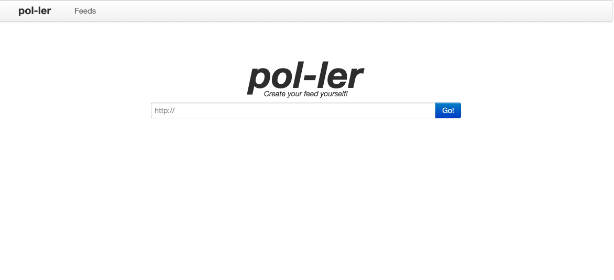

## Pol-ler

An improved RSS generator - renovated & fork of the no-longer-maintained [Pol](https://github.com/taroved/pol).



## Quickstart (Docker)

```
git clone https://github.com/aldotroiano/pol-ler
cd pol-ler
make build && make start
```

Visit http://localhost:8088

## Quickstart (Local)

```
git clone https://github.com/aldotroiano/pol-ler
cd pol-ler
make install
make migrate
make runserver
```

Visit http://localhost:8000

## Make commands

Run `make help` to list all targets. Common commands:

- **help**: Show help
- **start**: Start Docker containers
- **stop**: Stop Docker containers
- **restart**: Restart Docker containers
- **build**: Build Docker containers
- **logs**: Follow Docker logs
- **shell**: Open shell in container
- **install**: Install Python dependencies
- **migrate**: Run Django migrations (local)
- **loaddata**: Load initial data (local)
- **runserver**: Run Django development server (local)
- **downloader**: Run downloader server (local)
- **test**: Run tests
- **clean**: Remove Python cache files

## Access (port 8088)
Docker Host IP in browser. 

For exmaple:
````
http://localhost:8088
````

## License

MIT - 2016 Alexandr Nesterenko (https://github.com/taroved/pol)
